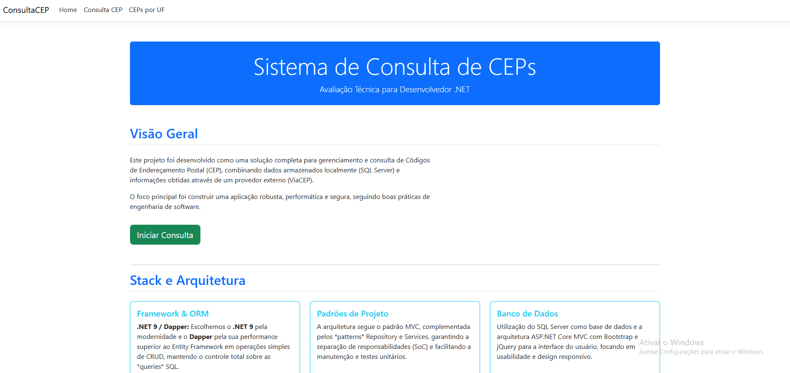
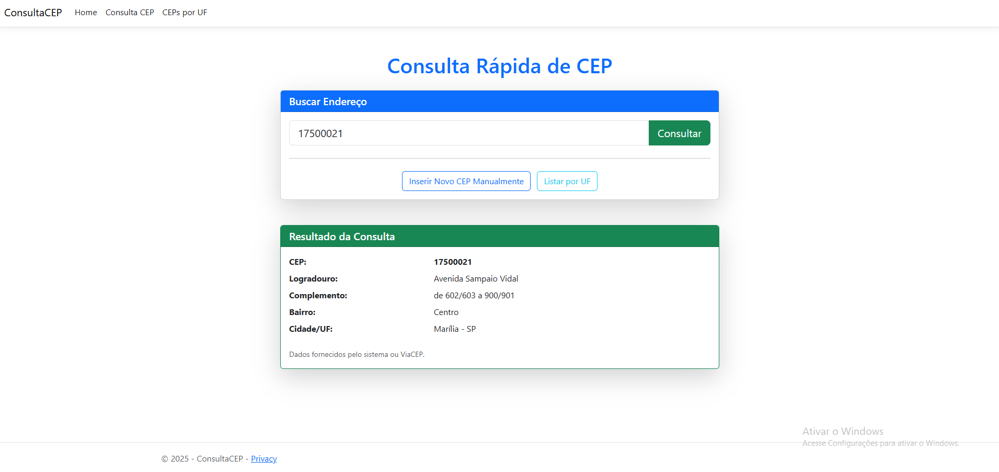
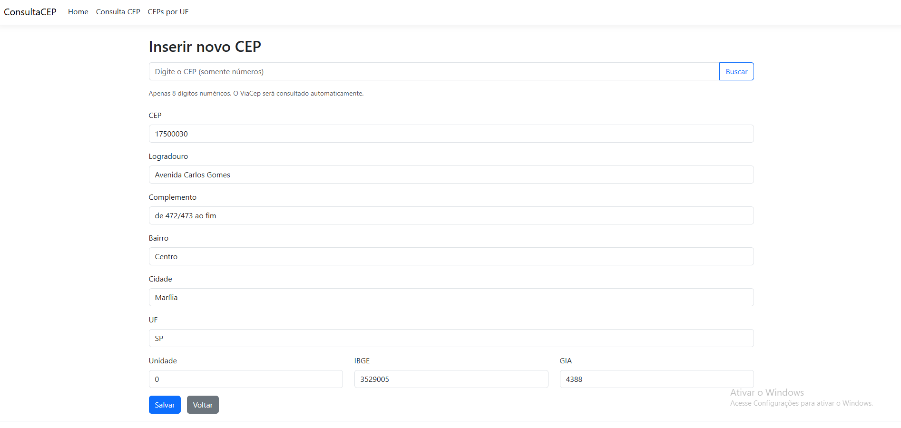
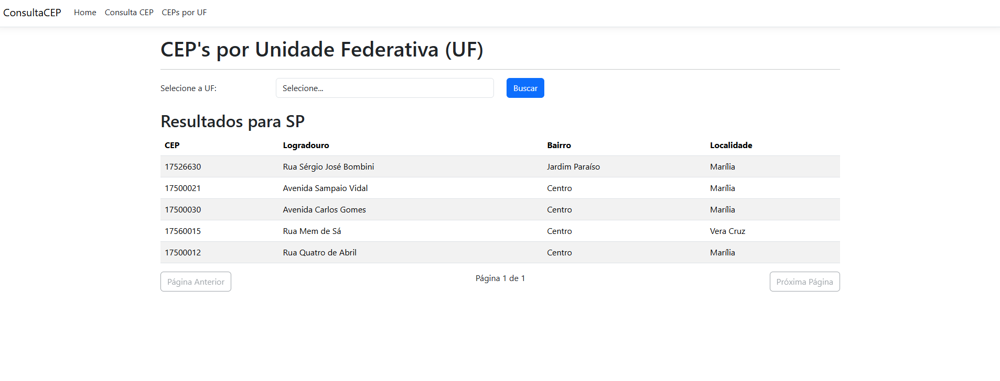

# 🚀 Projeto ConsultaCEP: Avaliação Técnica .NET

## 🌟 Visão Geral

Este projeto foi desenvolvido em 06/11/2025, como parte de uma Avaliação Técnica para a vaga de Desenvolvedor .NET. A solução implementa um sistema robusto para consulta, cadastro e gerenciamento de Códigos de Endereçamento Postal (CEP), integrando uma base de dados local com uma API externa (ViaCEP).

O foco principal do desenvolvimento foi a **performance**, **segurança** e a adesão a **boas práticas de arquitetura** e design de software.

### 📽️ Vídeo de demonstração:

Para ver o vídeo, link do youtube: [Clique aqui](https://youtu.be/Kl570-tYJxY).

## 🛠️ Stack Tecnológico

As seguintes tecnologias e padrões foram escolhidos para este projeto, com justificativas claras focadas em performance e manutenção:

* **Framework:** **ASP.NET Core 9.0**
* **Padrão de Projeto:** **MVC (Model-View-Controller)** com implementação de **Repository Pattern** e **Service Layer** para uma arquitetura limpa e separação de responsabilidades.
* **ORM/Acesso a Dados:** **Dapper** (Micro-ORM) - Escolhido pela sua performance superior em operações de CRUD quando comparado a ORMs completos, oferecendo total controle sobre o SQL gerado.
* **Banco de Dados:** **SQL Server** (Para persistência dos dados de CEP consultados).
* **Frontend:** Bootstrap 5 e jQuery (Para usabilidade, design responsivo e interatividade, como a máscara de CEP).

## 💡 Soluções e Boas Práticas Implementadas

Diversos desafios e boas práticas foram endereçados na construção da aplicação:

| Área | Solução Implementada | Benefício e Justificativa |
| :--- | :--- | :--- |
| **Performance/Custo** | **Mecanismo de Cache** | As requisições à API externa (ViaCEP) são cacheadas (`IDistributedCache` ou In-Memory) e armazenadas localmente. Isso reduz a latência e evita o uso excessivo e repetitivo da API, otimizando custos e tempo de resposta. |
| **Segurança** | **Parâmetros no Dapper** | Todas as consultas e comandos SQL utilizam **parâmetros nomeados** (`@CepNumber`, `@uf`), eliminando a concatenação de strings e, consequentemente, prevenindo ataques de **SQL Injection**. |
| **Mapeamento de Dados** | **Model Binding Problem (Prop. `Cep`)** | Para contornar um problema conhecido de **Model Binding** no .NET Core, onde nomes de propriedades como `Cep` podem conflitar com o tipo, a propriedade foi nomeada como **`CepNumber`**. |
| **UX/Performance** | **Paginação Otimizada em SQL** | A consulta de CEPs por UF utiliza os comandos `OFFSET` e `FETCH NEXT` (SQL Server) diretamente no Repository. Isso garante que apenas os 10 registros necessários sejam trazidos do banco, em vez de toda a lista, otimizando a performance e minimizando o tráfego de rede. |

## 📦 Estrutura do Projeto

O projeto segue um padrão claro, dividido por responsabilidades:

* **`Models`:** Contém as classes de domínio (`CEP`) e ViewModels (`CepByUfViewModel`).
* **`Repositories`:** Camada de acesso a dados. Implementa o Dapper e contém todas as *queries* SQL parametrizadas, garantindo que a lógica de negócio (Service) não se preocupe com a persistência.
* **`Services`:** Camada de regra de negócio. Responsável por orquestrar a lógica, como:
    * Verificação de cache/DB local antes de consultar a API externa.
    * Validações e processamento de dados.
* **`Controllers`:** Lida com a entrada do usuário e retorna a View apropriada.


## 📄 Endpoints Principais

| URL (Controller) | Método HTTP | Descrição |
| :--- | :--- | :--- |
| `/Cep/Index` | `GET`| Página principal de consulta de CEP. Permite consultar o CEP localmente ou via ViaCEP. |
| `/Cep/CepsByUf` | `GET` | Consulta otimizada e paginada de todos os CEPs armazenados para uma UF específica. |
| `/Cep/Create` | `GET` / `POST` | Formulário para cadastro manual de um novo CEP na base de dados. |

## 💫 Como rodar o projeto

Deverá ter instalado na máquina o .net 9.0 e SQL Server.

Localmente, criar um banco de dados CEP. Criação da tabela no banco de dados:

```sql
USE [CEP]
GO

SET ANSI_NULLS ON
GO

SET QUOTED_IDENTIFIER ON
GO

CREATE TABLE [dbo].[CEP] (
    [Id]          INT            IDENTITY (1, 1) NOT NULL,
    [cep]         CHAR (9)       NULL,
    [logradouro]  NVARCHAR (500) NULL,
    [complemento] NVARCHAR (500) NULL,
    [bairro]      NVARCHAR (500) NULL,
    [localidade]  NVARCHAR (500) NULL,
    [uf]          CHAR (2)       NULL,
    [unidade]     BIGINT         NULL,
    [ibge]        INT            NULL,
    [gia]         NVARCHAR (500) NULL
);
```

Verifique a string de conexão de acordo com seu DB.

Rodar o projeto: `dotnet run` apenas.

## 📺 Telas

### Home



### Consulta de CEP



### Inserindo novo CEP



### Consultando CEP por UF



## 👨🏽 Autor

Leonardo Ruoso Vendramini - 2025

